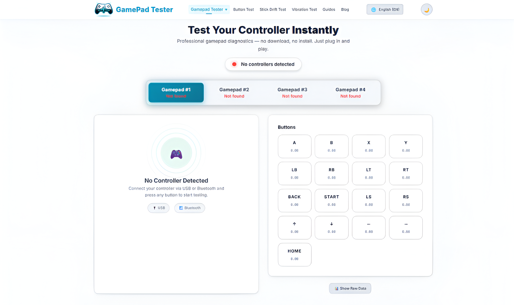

# Gamepad Tester Online 🎮

**Gamepad Tester** is a free online tool that lets you test your controller directly in your browser.
It detects button presses, joystick movements, triggers, and vibration support using the **Gamepad API**.

👉 **Try it here:**
https://gpadtester.org/

---

## 📷 Screenshot

## 🚀 Features

* Real-time controller detection
* Test **buttons, triggers, and analog sticks**
* Works with **Xbox, PlayStation, and generic USB controllers**
* No installation required
* Runs directly in your browser
* Built using JavaScript and the Gamepad API

---

## 🎮 Supported Controllers

The tester works with most modern controllers, including:

* Xbox controllers
* PlayStation controllers
* Generic USB gamepads
* Bluetooth controllers

Simply connect your controller and press any button to start testing.

---

## 🌐 Live Demo

Use the live tool online:

https://gpadtester.org/

This allows you to test your controller instantly without downloading any software.

---

## 🧰 Technologies Used

* HTML5
* CSS3
* JavaScript
* Browser Gamepad API

---

## ⚡ How It Works

1. Connect your controller to your computer.
2. Open the Gamepad Tester website.
3. Press any button on your controller.
4. The tool will display button presses and joystick movements in real time.

---

## 🔗 Website

Visit the official website:

https://gpadtester.org/

---

## 📄 License

This project is open source and available for educational and development purposes.
